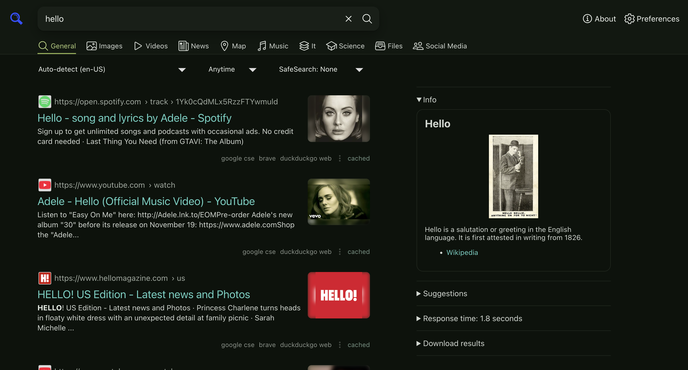

# SearXNG reskin!

This is simply a custom version with cleaner themeing and a few appearance customization options. Nothing fancy: uses OKLCH logic to keep hues and link/UI colors reasonably appealing. No additional network/font requests versus the base SearXNG.

To switch the theme color, go to Preferences and customize the hue of the theme or background flavor. **This is not a public instance.**


Example with the green theme:



## Quick start

Make sure you have Docker installed.

```sh
cp .env.example .env # make sure to edit the scret!
docker compose up -d
```

## Notes

You'll want to customize the SearXNG settings as needed for your specific use-case.

## Quick start

```sh
cp .env.example .env      # then edit SEARXNG_SECRET
docker compose up -d      # requires the .env secret
```

This'll set SearXNG to be on http://localhost:9000. Stop with `docker compose down`.

## Layout

- `searxng/settings.yml` has necessary instance settings.
- `ui/simple/base.html` holds the custom theme.
- `docker-compose.yml` pins the SearXNG image and has a Valkey cache.
